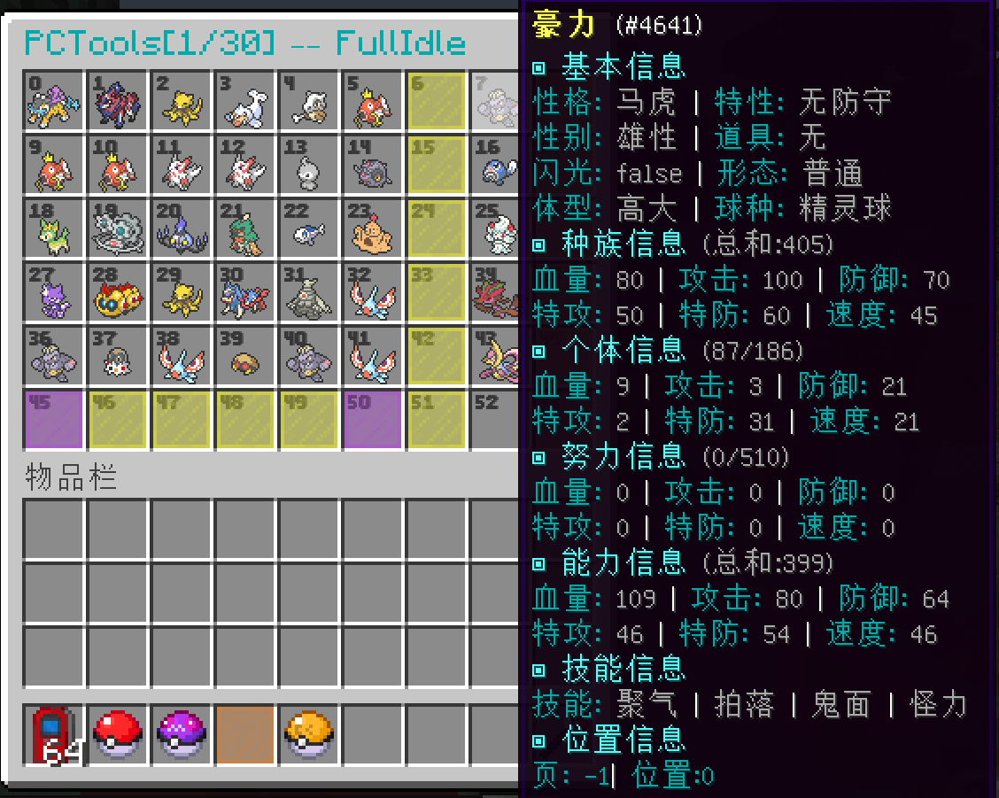
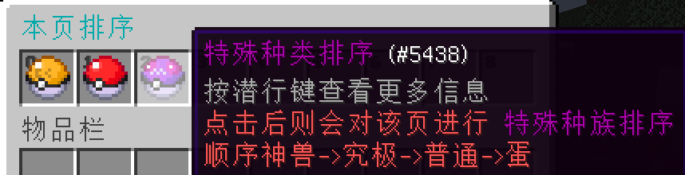
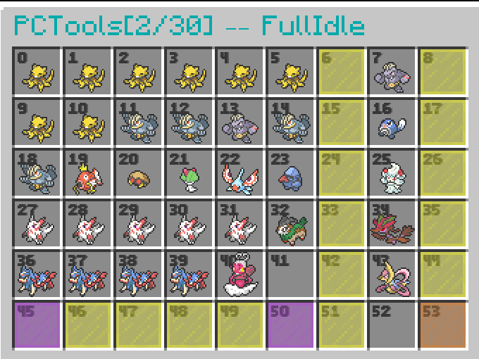

# PCTools
## 介绍
一个可以代替原版PixelmonMod的PC界面的插件
<br>用Minecraft原版容器进行显示
<br>多功能的界面让玩家方便使用(功能介绍请见下方)
<br>可以自定义精灵详细信息显示
<br>还原PC中宝可梦移动的逻辑让玩家用的更加舒适

## 效果图






## 配置
### [Config.yml](src/main/resources/config.yml)
## 指令
### open
#### 介绍
打开自己/指定玩家的指定页的pc
#### 用法
```
/pctools open (palyer|可选) (palyer|可选)
```
#### 权限节点
```yaml
pctools.cmd.open: 打开pc的权限 [默认拥有]
pctools.cmd.openother: 打开他人pc的权限 [默认op]
```
### help/reload/其他 [不做解释]
#### 权限节点
```yaml
help: 没有权限节点
pctools.cmd.reload: [默认op]
pctools.cmd.sort: 排序权限(没有该权限则pc界面没有排序按钮) [默认op]
```
## 功能
- [x] 带宝可梦翻页
- [x] 海量变量(详细见Config.yml)
- [x] SHIFT+CLICK(宝可梦)快速拿出/放入
- [x] SHFIT+CLICK(翻页)5倍翻页
- [x] 特定宝可梦自定义信息
- [x] 替换原版PC
- [x] 自定义背包是否保留最后一只精灵
- [x] 排序功能(排序指定页[详细游戏自测])
- [ ] 搜索功能